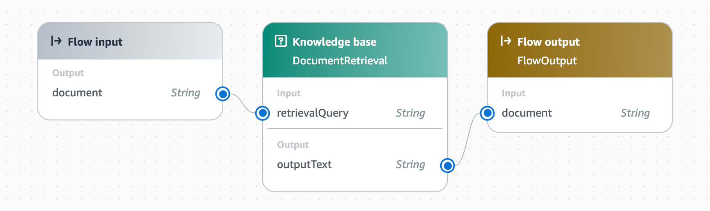
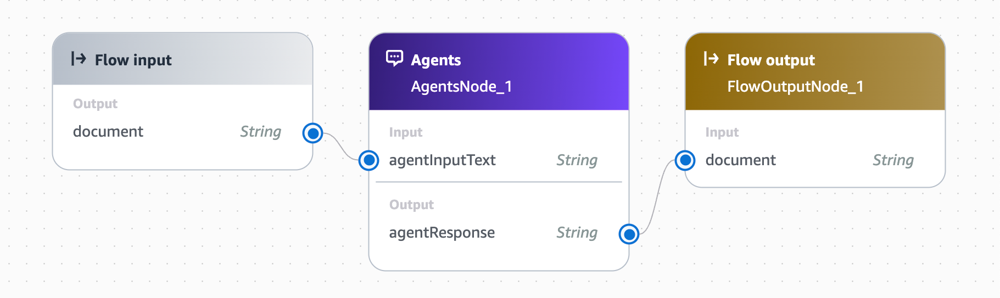
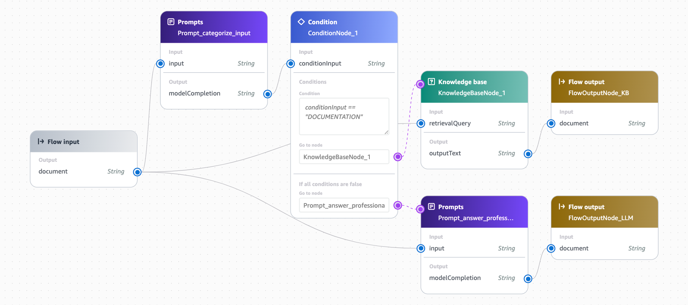
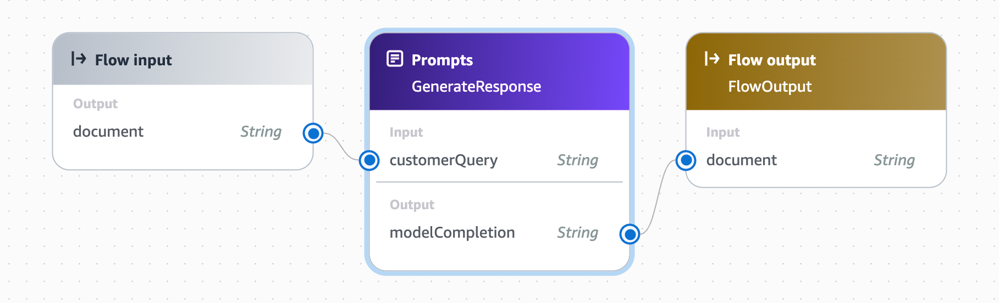
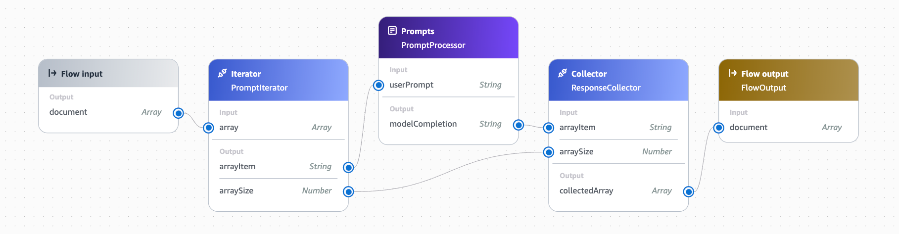
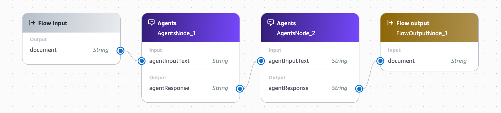

<h2 align="center">Amazon Bedrock Flows Samples</h2>
<p align="center">
  👋 Welcome to Amazon Bedrock Flows Samples 👋
</p>

This repository demonstrates how to import, create, invoke and delete [Amazon Bedrock Flows](https://aws.amazon.com/bedrock/flows/) using JSON Flow definition files, with examples implemented in Python.

<h3>Demo Video</h3>
<hr />
This video demonstrates how to create and use Amazon Bedrock Flows with JSON templates, including basic setup, template creation, and execution of flows.

<p align="center">
  <a href="https://www.youtube.com/watch?v=h9cyC6eQnBo"></a>
</p>

## 📚 Table of Contents

- [Overview](#overview)
- [Prerequisites](#prerequisites)
- [Quick Start](#quick-start)
- [How To Use](#how-to-use)
- [Repository Structure](#repository-structure)
- [Flow Definition (JSON)](#flow-definition-json)
- [Usage Examples](#usage-examples)
- [Flow Templates](#flow-templates)
- [Best Practices](#best-practices)
- [Resources](#resources)
- [Contributing](#contributing)

## Overview

Amazon Bedrock Flows allows you to define and orchestrate multi-step generative AI workflows. This repository shows how to:

- Create Flows using JSON template definitions
- Import/export Flow templates
- Execute and manage Flows via Python
- Implement common Flow patterns and best practices

## Prerequisites

- AWS Account with Amazon Bedrock access
- Python 3.10+
- Required packages:
  - boto3
  - termcolor
  - rich

## Quick Start

There are two ways to execute (import a Flow) the samples:

### 1. Command Line/Terminal

```bash
# Clone repository
git clone https://github.com/aws-samples/amazon-bedrock-flows-samples.git
cd amazon-bedrock-flows-samples

# Set up virtual environment
python -m venv src/venv
source src/venv/bin/activate  # Linux/Mac
# or
.\src\venv\Scripts\activate  # Windows

# Install requirements
pip install -r requirements.txt

# Run flow manager
python src/bedrock_flow_manager.py \
  --test-input "What is Amazon Bedrock?" \
  --cleanup
```

### 2. Jupyter Notebook

- Navigate to
`./notebooks/flow_notebook.ipynb`
- Follow the interactive examples and execute the cells sequentially
- The notebook provides a more interactive experience with detailed explanations and visualizations

## How To Use

### Command Line Arguments

The script supports various command-line arguments to customize its behavior. Here's a complete guide to all available options:

#### Basic Usage

```bash
python flow_manager.py [arguments]
```

#### Available Arguments

| Argument | Description | Default | Required |
|----------|-------------|---------|----------|
|--region| AWS region for Bedrock operations | Environment or 'us-west-2' | No |
|--profile| AWS profile name | Environment or 'default' | No |
|--flow-name| Custom name for the created flow | Template name | No |
|--test-input| Input text(s) for testing the flow | None | No |
|--cleanup| Clean up resources after testing | False | No |
|--templates-dir| Directory containing flow templates | './templates' | No |
|--existing-role| Name of existing IAM role to use | None | No |

### Examples

1. **Basic Usage** - Uses default settings:

```python
python flow_manager.py
```

2. **Specify Region and Profile**:

```python
python flow_manager.py --region us-east-1 --profile development
```

3. **Custom Flow Name**:

```python
python flow_manager.py --flow-name "MyCustomFlow"
```

4. **Test with Single Input**:

```python
python flow_manager.py --test-input "Hello, how are you?"
```

5. **Test with Multiple Inputs** (for iterator flows):

```python
python flow_manager.py --test-input "Input 1" "Input 2" "Input 3"
```

6. **Use Custom Templates Directory**:

```python
python flow_manager.py --templates-dir "/path/to/templates"
```

7. **Clean Up After Testing**:

```python
python flow_manager.py --test-input "Test message" --cleanup
```

8. **Use Existing IAM Role**:

```python
python flow_manager.py --existing-role "MyBedrockRole"
```

9. **Combined Example**:

```python
python flow_manager.py \
  --region us-west-2 \
  --profile production \
  --flow-name "ProductionFlow" \
  --test-input "Test message" \
  --cleanup \
  --existing-role "ProductionBedrockRole"
```

### Environment Variables

The script also respects the following environment variables:

- ``` `AWS_REGION` ```
or
``` `AWS_DEFAULT_REGION` ```

- ``` `AWS_PROFILE` ```
or
``` `AWS_DEFAULT_PROFILE` ```

These will be used if no command-line arguments are provided for region or profile.

### Notes

- The ``` `--test-input` ``` argument can accept either a single string or multiple space-separated strings for iterator flows

- When ``` `--cleanup` ``` is used, all created resources (flow, versions, aliases) are deleted after testing

- If ``` `--existing-role` ``` is not provided, the script will create a new IAM role with minimal required permissions

- Template directory will be created if it doesn't exist

- The script will interactively prompt for template selection if multiple templates are available

### IAM Role Permissions

When creating a new role (without using `--existing-role` ), the following permissions are granted:

```json
"bedrock:CreateFlow",
"bedrock:UpdateFlow",
"bedrock:GetFlow",
"bedrock:ListFlows", 
"bedrock:DeleteFlow",
"bedrock:ValidateFlowDefinition", 
"bedrock:CreateFlowVersion",
"bedrock:GetFlowVersion",
"bedrock:ListFlowVersions",
"bedrock:DeleteFlowVersion",
"bedrock:CreateFlowAlias",
"bedrock:UpdateFlowAlias",
"bedrock:GetFlowAlias",
"bedrock:ListFlowAliases",
"bedrock:DeleteFlowAlias",
"bedrock:InvokeFlow",
"bedrock:TagResource",
"bedrock:UntagResource", 
"bedrock:ListTagsForResource"
"bedrock:ApplyGuardrail",
"bedrock:InvokeGuardrail",
"bedrock:InvokeModel",
"bedrock:GetCustomModel",
"bedrock:InvokeAgent",
"bedrock:Retrieve",
"bedrock:RetrieveAndGenerate",
"bedrock:GetPrompt",
"bedrock:ListPrompts",
"bedrock:RenderPrompt"
"bedrock:GetAgent",
"bedrock:GetKnowledgeBase",
"bedrock:GetGuardrail",
```

If using an existing role (`--existing-role`), ensure it has the necessary permissions for your flow operations.

## Repository Structure

```bash
amazon-bedrock-flows-samples/
├── docs/
│   └── images/
│       ├── rag_kb_flow.png
│       ├── multi_turn_agent_flow.png
│       ├── conditions_flow.png
│       ├── prompt_guardrail_flow.png
│       ├── iterator_collector_flow.png
│       └── multi_agent_flow.png
├── notebooks/
│   ├── flow_notebook.ipynb
├── src/
│   └── bedrock_flow_manager.py
├── templates/
│   ├── rag_kb_flow.json
│   ├── multi_turn_agent_flow.json
│   ├── conditions_flow.json
│   ├── prompt_guardrail_flow.json
│   ├── iterator_collector_flow.json
│   └── multi-agent_flow.json
├── .gitignore
├── CODE_OF_CONDUCT.md
├── CONTRIBUTING.md
├── CONTRIBUTORS.md
├── LICENSE
├── README.md
├── RELEASE_NOTES.md
└── requirements.txt
```

## Flow Definition (JSON)

```json
{
  "description": "string",
   "executionRoleArn": "string",
   "name": "string",
   "tags": { 
      "string" : "string" 
   },
   "definition": { 
      "connections": [ 
         { 
            "configuration": { ... },
            "name": "string",
            "source": "string",
            "target": "string",
            "type": "string"
         }
      ],
      "nodes": [ 
         { 
            "configuration": { ... },
            "inputs": [ 
               { 
                  "expression": "string",
                  "name": "string",
                  "type": "string"
               }
            ],
            "name": "string",
            "outputs": [ 
               { 
                  "name": "string",
                  "type": "string"
               }
            ],
            "type": "string"
         }
      ]
   }
}
```

## Usage Examples

### 1. KnowledgeBase Flow

```bash
python src/bedrock_flow_manager.py \
  --test-input "What are the key features of Amazon Bedrock?" \
  --cleanup
```

### 2. Multi-turn Conversation Agent Flow

```bash
# Start a multi-turn conversation
python src/bedrock_flow_manager.py \
  --test-input "What does John Doe owe us?" \
  --cleanup

# The flow will prompt for additional information as needed:
# - Account details
# - Time period
# - Transaction types
```

### 3. Conditions Flow

```bash
# Input for conditional processing from KnowledgeBase
python src/bedrock_flow_manager.py \
  --test-input "What is Amazon Bedrock as per AWS documentation" \
  --cleanup
```

### 4. Prompt Node with Guardrail Flow

```bash
# Single input for guardrail flow
python src/bedrock_flow_manager.py \
  --flow-name "bedrock-flow-sample-prompt-with-guardrail" \
  --test-input "What is Amazon Bedrock?" \
  --cleanup
````

### 5. Iterator & Collector Flow

```bash
python src/bedrock_flow_manager.py \
  --test-input "What is Amazon Bedrock?" "Give code for hello world in rust" "give a simple json for showing hello bedrock flows" \
  --cleanup
```

```bash
# Input for conditional processing from LLM
python src/bedrock_flow_manager.py \
  --test-input "What is the source of Iron (Fe)" \
  --cleanup
```

### 6. Agentic Flow

```bash
# Input for agent-based processing, always responds with "Hello World"
python src/bedrock_flow_manager.py \
  --test-input "Create a marketing plan for a new AWS service" \
  --cleanup
```

### Additional Options

```bash
# Override flow name
python src/bedrock_flow_manager.py \
  --test-input "What is AWS?" \
  --flow-name "custom-flow-name" \
  --cleanup

# Specify region and profile
python src/bedrock_flow_manager.py \
  --test-input "What is AWS?" \
  --region us-west-2 \
  --profile dev-profile \
  --cleanup

# Use custom templates directory
python src/bedrock_flow_manager.py \
  --test-input "What is AWS?" \
  --templates-dir "./custom-templates" \
  --cleanup
```

## Flow Templates

### 1. [KnowledgeBase Flow](https://docs.aws.amazon.com/bedrock/latest/userguide/knowledge-base.html)

Template for integrating and querying knowledge bases:


- RAG (Retrieval Augmented Generation)
- Document Q&A
- Context-aware responses
- Knowledge base search and retrieval

### 2. [Multi-turn Conversation Agent Flow](https://aws.amazon.com/blogs/machine-learning/introducing-multi-turn-conversation-with-an-agent-node-for-amazon-bedrock-flows-preview/)

Template demonstrating interactive, stateful conversations:


- Multi-turn dialogues
- Context maintenance
- Progressive information gathering
- Conversational state management
- Dynamic response generation

### 3. Conditions Flow

Template showcasing conditional logic and branching:


- Decision trees
- Response routing
- Error handling
- Dynamic path selection

### 4. Prompt Node with Guardrail Flow

Template demonstrating the use of prompt nodes with content filtering and guardrails:


- Content moderation and filtering
- Input/output validation
- Safety boundaries and constraints
- Tone and style enforcement

### 5. Iterator & Collector Flow

Template for processing multiple inputs and aggregating responses:


- Parallel execution
- Response aggregation
- Multi-query handling
- Batch processing

### 6. [Multi-Agent Flow](https://docs.aws.amazon.com/bedrock/latest/userguide/agents.html)

Template demonstrating agent-based workflows:


- Multi-agent collaboration
- Task delegation
- Specialized agent routing
- Complex task orchestration

## Best Practices

- Use clear, descriptive step names
- Include error handling in Flow definitions
- Validate inputs before Flow execution
- Use environment variables for configuration
- Follow AWS security best practices

## Resources

🔗 Related Links:

- [Amazon Bedrock Flows Documentation](https://docs.aws.amazon.com/bedrock/latest/userguide/flows.html)
- [AWS SDK for Python](https://boto3.amazonaws.com/v1/documentation/api/latest/reference/services/bedrock-agent/client/create_flow.html)
- [Amazon Bedrock Samples](https://github.com/aws-samples/amazon-bedrock-samples/tree/main)
- [Multi-turn conversation with an agent node for Amazon Bedrock Flows](https://aws.amazon.com/blogs/machine-learning/introducing-multi-turn-conversation-with-an-agent-node-for-amazon-bedrock-flows-preview/)
- [Amazon Bedrock KnowledgeBase](https://docs.aws.amazon.com/bedrock/latest/userguide/knowledge-base.html)
- [Amazon Bedrock Agents](https://docs.aws.amazon.com/bedrock/latest/userguide/agents.html)

## Contributing

See [CONTRIBUTING](CONTRIBUTING.md#contributing-flow-templates) for more information.

## Security

See [CONTRIBUTING](CONTRIBUTING.md#security-issue-notifications) for more information.

## License

This project is licensed under the MIT-0 License. See the [LICENSE](LICENSE) file.

> [!IMPORTANT]
> Examples in this repository are for demonstration purposes.
> Ensure proper security and testing when deploying to production environments.

## Contributors 💪

<a href="https://github.com/aws-samples/amazon-bedrock-flows-samples/graphs/contributors">  </a>

## Stargazers ⭐

[](https://github.com/aws-samples/amazon-bedrock-flows-samples/network/stargazers)

## Forkers 🙌

[](https://github.com/aws-samples/amazon-bedrock-flows-samples/network/members)
